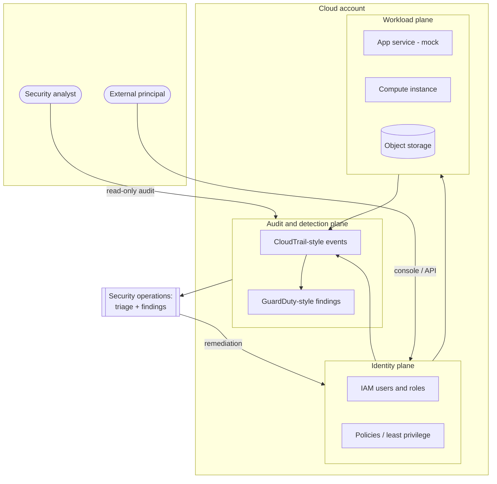

# Lab architecture

The lab models a single cloud account running one small application, plus the
identity, logging, and detection services around it. It's deliberately minimal —
just enough surface area to produce interesting IAM decisions and a few alerts
worth triaging.

## Trust boundaries

The interesting decisions happen where one trust level hands off to another.
There are four worth naming:

1. **Internet to control plane.** Anything reaching the console or API from
   outside. This is where the no-MFA console login in `examples/events/` lands.
2. **Human identity to account roles.** A person assuming a role is the moment a
   small permission mistake becomes a large blast radius — hence the weight on
   IAM review.
3. **Workload to logging.** Resources have to emit to CloudTrail/GuardDuty
   without being able to tamper with what they emitted. Log integrity is a
   boundary, not a feature.
4. **Analyst read access to findings.** The security-audit role can read logs and
   findings but cannot change the workload. That separation is itself a control,
   and it's modelled by `least-privilege-policy.json`.

## Design principles the lab assesses against

- **Least privilege by default.** Grants start at deny and open up only for a
  named need. The two policies in `examples/iam/` are the before/after.
- **Centralized, tamper-evident logging.** One place to look, and a retention
  goal that assumes an attacker will try to cover their tracks.
- **Detect → triage → remediate → re-validate.** A finding isn't closed when the
  fix ships; it's closed when a re-run confirms the signal is gone.

> If the Mermaid block above doesn't render in your viewer, GitHub and most
> Markdown previews draw it inline. Reading the raw file, the block itself is
> the source of truth for the layout.
