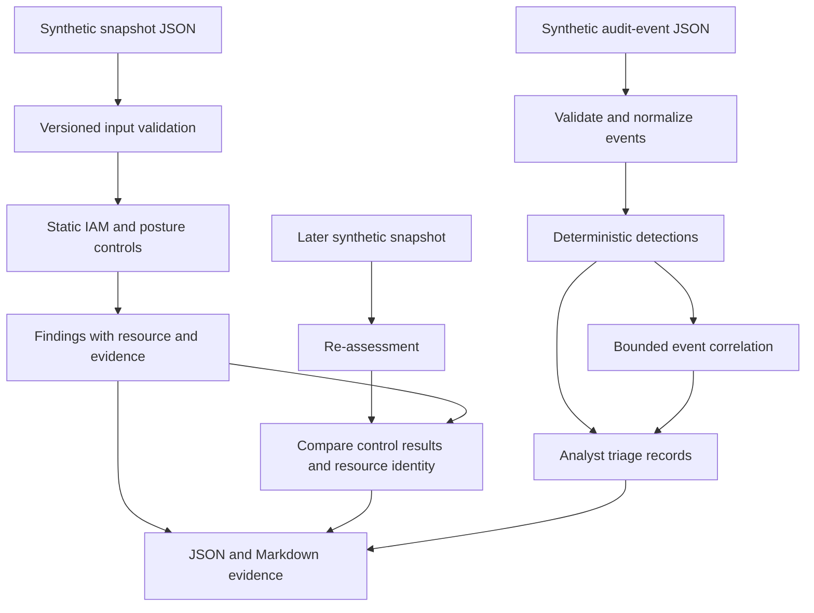

# Architecture

The lab is a local Python package. JSON files supply synthetic cloud state and audit events. There is no AWS SDK, cloud connection, infrastructure, or hosted service.

## Trust boundaries

- **Input to evaluator:** fixtures are untrusted data. Validation rejects malformed supported fields and unsupported schema versions. A valid fixture can still contain false assertions; this is not authenticated cloud evidence.
- **IAM document to finding:** selected risky statement patterns produce findings. The analyzer does not compute AWS effective permissions.
- **Assessment to verification:** closure is derived by assessing both snapshots. Editing an output status cannot close a finding. Missing resources or incompatible snapshots must not be mistaken for a verified fix.
- **Event to alert:** explicit predicates produce reviewable evidence, not declarations that an actor is malicious.
- **Code to ground truth:** expected results live in fixture manifests/tests, separately from evaluators. Tests cover negative cases and boundaries as well as the demo.

Reports include fixture metadata and source hashes. Hashes identify evaluated local bytes; they do not authenticate their author or establish a real account's state.

## Design choices

A standard-library runtime keeps the demo portable and credential-free. Control IDs, fixed severities, deterministic ordering, and stable finding IDs make results inspectable. No aggregate risk score hides the evidence.

The original [IAM examples](../examples/iam/policy-analysis.md), [GuardDuty sample](../examples/events/guardduty-credential-access.json), and [Sigma references](../detections/cloud-detections.md) remain teaching artifacts. GuardDuty is not connected and Sigma is not loaded by the Python detector.

Terraform and a live adapter were omitted because snapshots already provide reproducible configuration input. A future read-only adapter would need authenticated collection, coverage checks, pagination, least-privilege credentials, and live-data handling before its output could be trusted.
